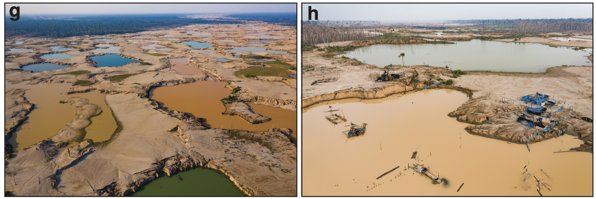
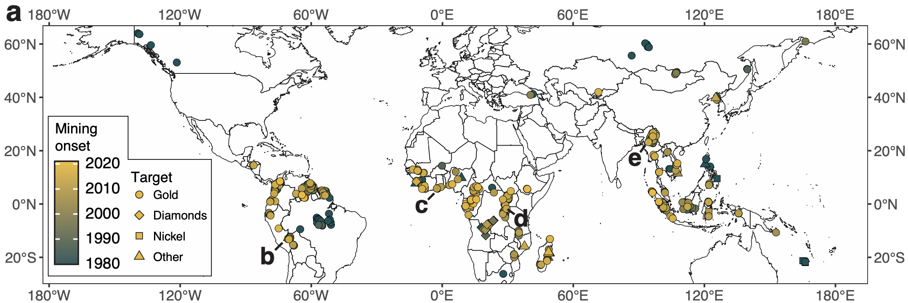

# River mineral mining 
**Mapping and documenting the effects of mining for gold and precious minerals in streams and rivers across the world**

***

#### What is river mineral mining?
**River mineral mining** is mining that occurs in and around rivers and streams. Such mining has a long history and many names, including "alluvial mining", "placer mining" and "hydraulic mining". We use the term "river mineral mining", or sometimes just "river mining", defined as any mining that has a direct surface water connection to a river. Sometimes, mining happens directly in rivers themselves. In other cases, miners excavate river banks, floodplains, and terraces. 

 

**Mining in rivers was key to the United States mining rushes of the 19th century. High-powered jets of water were used to rapidly erode river beds and banks, just as they are today in the tropics. This image from California in the 1860s or 1870s shows hydraulic mining underway, with excavation by high-powered jets of water. Image from the US Library of Congress.[^1]**

* * *

#### How does river mining work?
In most cases, after excavation, miners process sediment to extract gold or other precious minerals. Often, miners do so by sending a slurry of water and sediment down a *sluice*. A sluice is a ramp or channel that has simple elements like riffles and settling boxes that use gravity to separate the precious minerals from the other sediment. Other separation methods exist as well, some larger and some smaller. But most of them use the same principle: gravity separating the targeted mineral from flowing water and sediment.

The excess sediment and water is often discharged directly into streams and rivers, either inadvertently during excavation or intentionally after separation. This input of sediment to rivers causes them to become cloudy or muddy. We measure such changes in muddiness as **"suspended sediment concentration"**, defined as the weight of sediment particles in a given volume of water. In many cases, chemical ore-processing aids, most commonly mercury, also flow into streams and rivers. Both the sediment itself and these chemical contaminants can cause serious environmental degradation in affected rivers, with negative consequences for fish and other flora and fauna.

* * *

#### Mining boom in the global tropics

**River mineral mining in modern operations closely resemble past operations. Here images from Peru show swaths of deforestation and excavation in a mining region in Madre de Dios. Photos were taken by Jason Houston for Wake Forest University.**

River mining waned in the United States and other countries with 19th and early-20th century rushes. In some countries, legislation established regulations forbidding most river mining activity. Shifts to hard-rock mining in large pits or underground veins proved to be more lucrative in some instances. 

However, a major river mining boom, especially targeting gold, is underway across the global tropics. That boom is the subject of this work. 

 

**Mining for gold has altered many rivers and floodplains, including as shown here in the Uyu River Watershed, Myanmar. Image are generated by NASA/USGS Landsat imagery.**

* * *

#### Satellite monitoring of river mining impacts

The reach and scale of the ongoing river mining boom is under appreciated. We find that such mining occurs in at least 49 countries, altering water quality and geomorphology in many river systems. We used high-resolution satellite and aerial imagery to map the locations of about 400 individual mining operations. 

 

**Mining operations span the globe, concentrated in the global tropics. Though these operations target many different minerals, gold mining is the most common.**

 

We built on our past work [^2][^3] and used Landsat satellite imagery to estimate how **suspended sediment concentration** has changed over time in the rivers affected by the recent mining boom. We compared mining periods to pre-mining reference periods and found major increases in almost every case. These changes likely help explain the widespread increases in river suspended sediment we identified in global rivers [^4].

* * *

#### Data and code for this analysis
The code for this analysis is stored in this repository. Source data from Landsat and produced by us can be downloaded from this github page. All necessary data is here, except for unprocessed kml Landsat data, which is stored in the Zenodo repository and on Google Earth Engine:

**Source data**

[Zenodo repository: mining locations, unprocessed Landsat data, other source data](https://10.5281/zenodo.7699122)  

[Source data, not including unprocessed Landsat data](https://github.com/evandethier/global-alluvial-mining/tree/main/global-asgm-imports)  

[Convert mining location kmls to shapefiles](R/0A_kml_to_shp_for_google_earth_engine.R)  

 

**Code to run**

[Import data](R/1_initial_data_proceessing.R)  

[Analyze river mining data](R/2_river_mining_analysis.R)  

[Analysis of oil palm impacts (need to run initial river mining analysis first)](R/3_oil_palm_sub_analysis.R)  

[Analyze rivers that are too small for Landsat mapping](R/small_river_analysis.R)  

***

#### References
[^1]: Lawrence & Houseworth, P. (1866) Hydraulic mining near French Corral, Nevada County. Nevada County California, 1866. [Published] [Photograph] Retrieved from the Library of Congress, <https://www.loc.gov/item/2002719066/>.

[^2]: Dethier, E. N., Sartain, S. L., & Lutz, D. A. (2019). Heightened levels and seasonal inversion of riverine suspended sediment in a tropical biodiversity hot spot due to artisanal gold mining. *Proceedings of the National Academy of Sciences*, 116(48), 23936-23941.

[^3]: Dethier, E. N., Renshaw, C. E., & Magilligan, F. J. (2020). Toward improved accuracy of remote sensing approaches for quantifying suspended sediment: Implications for suspended‐sediment monitoring. *Journal of Geophysical Research: Earth Surface*, 125(7), e2019JF005033.

[^4]: Dethier, E. N., Renshaw, C. E., & Magilligan, F. J. (2022). Rapid changes to global river suspended sediment flux by humans. *Science*, 376(6600), 1447-1452.

